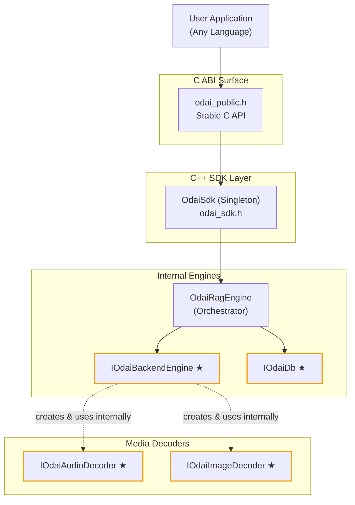

# ODAI SDK — Architecture Overview

> [!NOTE]
> This document is the central hub for the SDK's architecture. It is a **living document** — update it whenever structural changes are made.

## System Layers

The SDK is organized into four top-level areas, each with a clear responsibility boundary:

**★ = Swappable interface** — concrete implementations can be replaced at build time.

### Layer Responsibilities

| Layer | Files | Responsibility |
|---|---|---|
| **C ABI Surface** | `odai_public.h` / `odai_public.cpp` | Stable binary interface. Sanitizes C inputs, converts to C++ types, forwards to SDK, and returns `c_OdaiResult` for migrated operation-style APIs while keeping payload ownership in output pointers. Exposes explicit lifecycle entry points such as `odai_initialize_sdk()` and `odai_shutdown()`. |
| **C++ SDK** | `odai_sdk.h` / `odai_sdk.cpp` | Singleton orchestrator. Validates business logic, manages lifecycle, routes to engines, and uses `OdaiResult` for operation-style C++ APIs, including streaming calls via `OdaiResult<StreamingStats>`. |
| **Internal Engines** | `OdaiRagEngine`, interfaces | Core logic. RAG engine owns a `IOdaiBackendEngine` and `IOdaiDb` instance, and uses `OdaiResult` for operational APIs, including DB initialization and streaming generation. |
| **Media Decoders** | `IOdaiAudioDecoder`, `IOdaiImageDecoder` | Stateless decoders created on-demand by the backend engine internally to process multimodal inputs (images, audio) before inference. |

For the full request lifecycle (C types → sanitize → convert → SDK → engine), see [Data Flow & Type System](./data-flow-and-type-system.md).

---

## Documentation Boundaries

- `docs/architecture/` owns stable structure: layers, interfaces, implementations, data flow, and current runtime responsibilities.
- [`dev_nuances.md`](../../dev_nuances.md) owns non-obvious rationale: build quirks, third-party integration workarounds, platform-specific gotchas, and behavior that exists mainly because tools or dependencies behave a certain way.
- When a topic needs both, keep the architectural shape here and link to `dev_nuances.md` for the workaround-heavy reasoning instead of repeating it.

---

## Swappable Interfaces

Each interface defines a contract that concrete implementations must fulfill. The active implementation is selected at **compile time** via CMake flags (e.g. `ODAI_ENABLE_LLAMA_BACKEND`, `ODAI_ENABLE_SQLITE_DB`).

| Interface | Purpose | Current Implementation | Docs |
|---|---|---|---|
| [`IOdaiBackendEngine`](./interfaces/backend-engine.md) | LLM inference (load models, generate tokens) | `OdaiLlamaEngine` (llama.cpp) | [impl](./implementations/llamacpp-backend.md) |
| [`IOdaiDb`](./interfaces/database.md) | Persistence (models, chats, semantic spaces, media cache) | `OdaiSqliteDb` (SQLite + sqlite-vec) | [impl](./implementations/sqlite-database.md) |
| [`IOdaiAudioDecoder`](./interfaces/audio-decoder.md) | Decode audio files to raw PCM samples | `OdaiMiniAudioDecoder` (miniaudio) | [impl](./implementations/miniaudio-decoder.md) |
| [`IOdaiImageDecoder`](./interfaces/image-decoder.md) | Decode image files to raw pixel buffers | `OdaiStbImageDecoder` (stb_image) | [impl](./implementations/stb-image-decoder.md) |

---

## Concrete Orchestrator: OdaiRagEngine

`OdaiRagEngine` is **not** behind an interface — it is the single concrete orchestrator that ties together the backend engine and database. It owns:

- `std::unique_ptr<IOdaiBackendEngine> m_backendEngine`
- `std::unique_ptr<IOdaiDb> m_db`

It handles model registration/update workflows, chat session management, and streaming response generation. See `src/include/ragEngine/odai_rag_engine.h`.

---

## Key Concepts

| Concept | Description |
|---|---|
| **Semantic Space** | A logical knowledge domain sharing an embedding model and chunking strategy. |
| **Scope** | A partition key within a Semantic Space for data isolation (e.g. per-user, per-app). |
| **Model Registration** | Models are registered by name with file paths. The backend engine validates files; the DB stores metadata and checksums. |
| **Compile-Time Swapping** | Implementations are toggled via `#ifdef` guards and CMake options. Only one implementation per interface is compiled into the binary. |

---

## Adding a New Swappable Implementation

1. **Create the header** in `src/include/<engineDir>/<yourImpl>/` — inherit from the interface.  
2. **Create the implementation** in `src/impl/<engineDir>/<yourImpl>/`.  
3. **Add a CMake guard** (`ODAI_ENABLE_YOUR_IMPL`) and wire it into `CMakeLists.txt`.  
4. **Wire the factory** — update `odai_sdk.cpp` (or `odai_rag_engine.cpp`) to instantiate your impl when the flag is set.  
5. **Document** — add a file in `docs/architecture/implementations/` and link it from this README.

For coding patterns and conventions, see the [Development Guide skill](../../.agents/skills/odai_development_guide/SKILL.md).

---

## Further Reading

- [Data Flow & Type System](./data-flow-and-type-system.md) — Request lifecycle, C↔C++ type layers, memory ownership
- [Testing Architecture](./testing.md) — Test framework design, layer mapping, data pipeline, fixture patterns
- [Development Guide](../../.agents/skills/odai_development_guide/SKILL.md) — Coding patterns, naming conventions, interface design rules
- [Build Nuances](../../dev_nuances.md) — Build system quirks and gotchas
