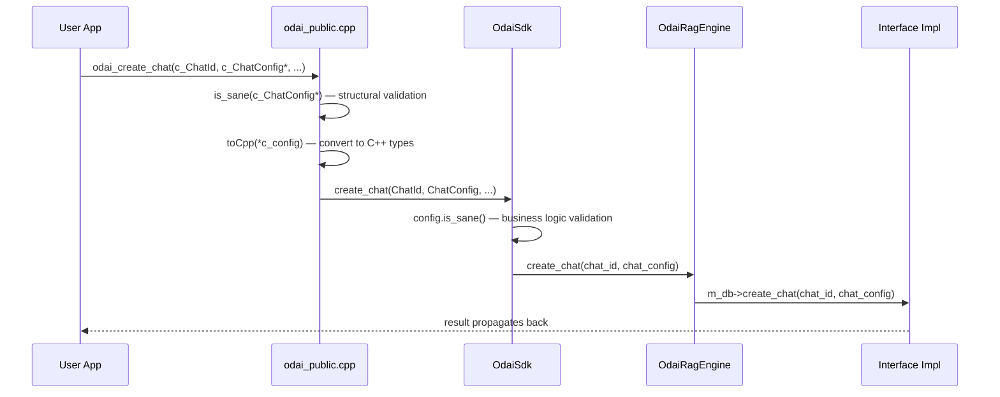

# Data Flow & Type System

This document describes how data moves through the SDK layers and how the dual C/C++ type system works.

## Request Lifecycle

Every external call follows the same pattern through the layers:



### Layer-by-Layer Responsibilities

| Step | Layer | What Happens |
|---|---|---|
| 1. Receive | C API (`odai_public.cpp`) | Accept raw C types (`c_ChatConfig*`, `c_ChatId`, etc.) |
| 2. Sanitize | C API | Call `is_sane()` from `odai_csanitizers.h` — null checks, enum range checks, pointer validity |
| 3. Convert | C API | Call `toCpp()` from `odai_type_conversions.h` — C structs → C++ objects |
| 4. Validate | C++ SDK (`odai_sdk.cpp`) | Call `config.is_sane()` — business logic (empty strings, invalid ranges) |
| 5. Execute | Internal Engines | Forward to `OdaiRagEngine`, which delegates to `IOdaiBackendEngine` / `IOdaiDb` implementations |
| 6. Return | All layers | Convert back to C if needed (`toC()`); return `bool`, `int32_t`, or `c_OdaiResult` |

---

## Dual Type System

The SDK maintains strict separation between types used at the API boundary and types used internally.

```
┌─────────────────────────────────┐
│  C Types  (odai_ctypes.h)       │  ← API boundary, stable ABI
│  c_ChatConfig, c_InputItem, ... │
│  Prefixed with c_               │
├─────────────────────────────────┤
│  Sanitizers (odai_csanitizers.h)│  ← Structural validation
│  is_sane(const c_Type*)         │
├─────────────────────────────────┤
│  Converters                     │  ← Boundary crossing
│  (odai_type_conversions.h)      │
│  toCpp() / toC()                │
├─────────────────────────────────┤
│  C++ Types (odai_types.h)       │  ← Internal logic
│  ChatConfig, InputItem, ...     │
│  Use STL (std::string, vector)  │
│  Have is_sane() for validation  │
└─────────────────────────────────┘
```

### Key Rules

- **C types never leak into internal code** — all engine/interface methods accept C++ types only.
- **C++ types never appear in `odai_public.h`** — the public header uses only C-compatible types.
- **Converters assume safe input** — `toCpp()` relies on `is_sane()` having been called first.
- **Enums use fixed-width typedefs** — `typedef uint8_t c_ModelType` instead of C `enum` for ABI stability.
- **No unions in public API** — use tagged structs instead.
- **Backend-specific type conversions** follow `to_odai_<type>()` naming (e.g. `to_odai_backend_device_type()`).

---

## Memory Ownership

| Scenario | Rule |
|---|---|
| C consumer allocates memory | C consumer frees it |
| `toC()` allocates `char*` / arrays | SDK provides matching `odai_free_*()` function |
| Struct members allocated by `toC()` | Use `free_members(c_Type*)` before freeing the struct |
| `std::unique_ptr` in C++ internals | Automatic cleanup via RAII |

### Example: Chat Messages

```
odai_get_chat_history()        → allocates c_ChatMessage array
    ... use messages ...
odai_free_chat_messages()      → frees each message's members, then the array
```

---

## Config Structs & Validation

All C++ config structs implement `is_sane()` for self-validation:

```cpp
struct SamplerConfig {
    uint32_t m_maxTokens = DEFAULT_MAX_TOKENS;
    float m_topP = DEFAULT_TOP_P;
    uint32_t m_topK = DEFAULT_TOP_K;

    bool is_sane() const {
        return m_maxTokens > 0
            && m_topP >= 0.0f && m_topP <= 1.0f
            && m_topK > 0;
    }
};
```

The `is_sane()` pattern provides two-stage validation:
1. **C layer** (`odai_csanitizers.h`): Structural checks (null pointers, enum ranges)
2. **C++ layer** (`.is_sane()` methods): Business logic checks (empty names, invalid combinations)

---

## See Also

- [Architecture Overview](./README.md) — System layers and swappable boundaries
- [Development Guide](../../.agents/skills/odai_development_guide/SKILL.md) — Implementation patterns (Step 1/Step 2 walkthrough)
