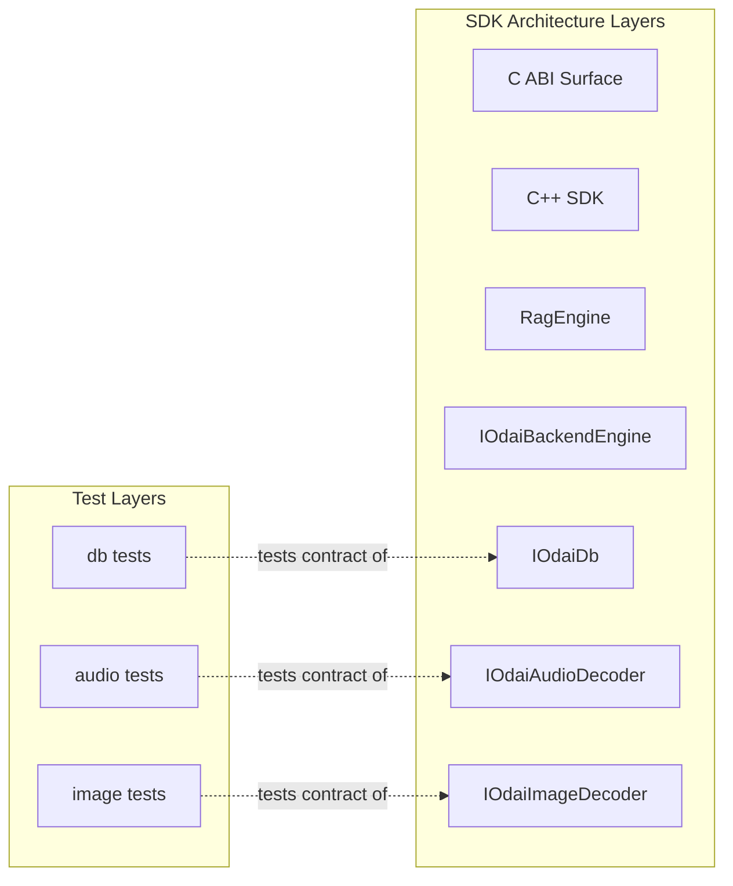
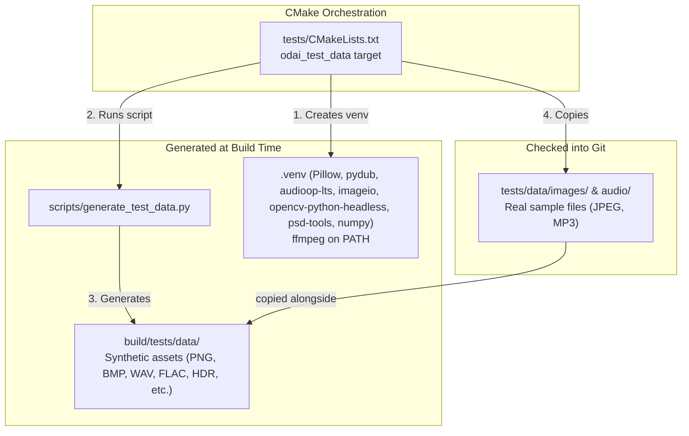

# Testing Architecture

> [!NOTE]
> This document describes the **structure, design, and rationale** of the ODAI SDK testing framework. It is a **living document** — update it whenever the testing infrastructure changes.
> For day-to-day build/run commands, see the [Testing Guide skill](../../.agents/skills/odai_testing_guide/SKILL.md).
> For non-obvious test assertion reasoning and manual verification, see [`test_nuances.md`](../../test_nuances.md).

---

## Design Philosophy

The testing framework is built on six principles:

1. **Real implementations, no mocks.** Tests use the same concrete implementations that ship with the SDK. The SDK's compile-time swapping architecture means mock implementations don't naturally fit — and wouldn't test the code paths that matter.

2. **Test the layer contract, not internals.** Each test suite targets one architectural layer's public API. Internal helpers, sanitizers, and converters are exercised indirectly — if they break, a layer-level test catches it.

3. **Per-layer isolation for fast feedback.** CTest labels let developers run only the layer they changed. Work in one layer should not require running unrelated layers unless the change crosses that boundary.

4. **Graceful degradation for expensive resources.** Model-backed tests skip cleanly when model files aren't available, rather than failing. This keeps the fast test suite runnable everywhere.

5. **Reusable interface contracts where implementations are swappable.** When a layer tests a swappable interface, split reusable interface contract coverage from implementation-specific coverage. Contract suites live inside the owning layer directory and can be reused by future implementations of the same interface.

6. **Broad contract coverage without combinatorial duplication.** When several inputs exercise the same layer contract, keep deep behavior coverage on representative fixtures and add lighter end-to-end coverage for additional supported variants. Expand the matrix only when a variant has distinct ODAI-owned behavior or a history of regressions.

---

## Relationship to SDK Architecture

The test framework mirrors the SDK's layer structure. Each testable layer maps 1:1 to an architectural layer documented in the [Architecture Overview](./README.md):



**What is NOT separately tested:**
- **C API / SDK / RAG workflows** — Planned for later testing phases; no GoogleTest targets are registered for these layers yet.
- **OdaiSdk singleton** — Planned to be covered through C API and E2E tests instead of isolated singleton tests.
- **OdaiRagEngine** — Planned to be tested implicitly through E2E workflows.
- **Internal helpers** (`is_sane()`, `toCpp()`/`toC()`, sanitizers) — Exercised indirectly by current and future layer tests, never tested in isolation.
- **Backend interface contract suite** — Deferred. Backend tests are planned as implementation-backed integration tests because the llama.cpp backend is model/resource-sensitive and needs a separate contract design.

---

## Test Classification

| Category | Scope | What it proves | Needs models? |
|---|---|---|---|
| **Contract** | A swappable interface through one concrete implementation | The reusable interface behavior is satisfied and can be applied to future implementations | Varies by interface |
| **Integration** | One layer's public API in isolation | The contract for a single swappable interface/layer works correctly | Varies by layer |
| **E2E** | Full multi-layer workflow through C API | Planned; layers work together: `C API → SDK → RAG → Backend → DB` | Yes |

Contract tests are also integration tests in CTest labeling because they execute real compiled implementations, not mocks.
Backend engine tests and E2E tests are planned/deferred and do not have active GoogleTest targets yet.

---

## Directory Structure

Tests live in `tests/` and mirror `src/impl/`. Each layer has its own subdirectory:

```
tests/
├── CMakeLists.txt                  ← Test data generation + layer subdirectories
├── odai_test_helpers.h             ← Cross-layer byte/string/result/file/input helpers
├── odai_decoder_test_helpers.h     ← Shared decoder fixture path and shape helpers
├── db/
│   ├── CMakeLists.txt              ← Implementation-gated targets; SQLite labels include "sqlite"
│   ├── odai_db_contract_tests.h    ← Reusable IOdaiDb typed contract suite
│   ├── odai_db_test_helpers.h
│   ├── odai_sqlite_db_contract_test.cpp
│   └── odai_sqlite_db_test.cpp     ← SQLite-specific behavior
├── imageEngine/
│   ├── CMakeLists.txt              ← Implementation-gated targets; STB labels include "stb"
│   ├── odai_image_decoder_contract_test.cpp
│   └── odai_stb_image_decoder_test.cpp
├── audioEngine/
│   ├── CMakeLists.txt              ← Implementation-gated targets; miniaudio labels include "miniaudio"
│   ├── odai_audio_decoder_contract_test.cpp
│   └── odai_miniaudio_decoder_test.cpp
└── data/
    ├── images/                     ← Real sample files (checked into git)
    │   └── sample_chamaleon.jpg
    └── audio/
        └── Echoes_of_Unseen_Light.mp3
```

---

## Test Data Pipeline

Test data comes from two sources with different lifecycles:



**Why two sources?**
- **Real sample files** (JPEG, MP3) exercise real-world codec paths — they have encoder padding, compression artifacts, and variable metadata that synthetic files lack.
- **Generated synthetic files** (tiny PNG, BMP, WAV, FLAC) have deterministic dimensions or audio topology, so tests can make precise structural assertions without checking in more binary assets.

**How it works:**
1. CMake creates a Python venv in the build directory (cached, instant if already created)
2. *Crucial*: `tests/CMakeLists.txt` checks for `ffmpeg` and installs required Python libraries into the venv via pip (`Pillow pydub audioop-lts imageio opencv-python-headless psd-tools numpy`). **If you add a new dependency to `generate_test_data.py`, you MUST update `tests/CMakeLists.txt` to install or check it.**
3. `generate_test_data.py` produces small synthetic assets with known properties
4. Real sample files from `tests/data/` are copied alongside the generated ones into the build output
5. `tests/CMakeLists.txt` declares the generated and copied fixture paths as custom-command outputs, so deleting a build-local fixture causes CMake to recreate the fixture set. If a fixture is added, removed, or renamed, update this output list with the generator/copy rule.
6. Before generation, the build-local fixture directory is removed so deleted or renamed generated assets cannot linger in `build/tests/data`
7. Test CMake targets inject `TEST_DATA_DIR` as a compile definition pointing to the build output directory

This means test binaries can locate assets regardless of the working directory they're invoked from.

---

## CMake Integration

### Feature Gating

Each layer's `CMakeLists.txt` gates implementation-specific targets by the same build flag that enables the implementation. The matching contract target for that implementation is created under the same guard, so CTest only registers contract and implementation tests for implementations actually compiled into `odai`:

```cmake
# Example: tests/db/CMakeLists.txt
if(ODAI_ENABLE_SQLITE_DB)
    add_executable(odai_sqlite_db_contract_tests ...)
    add_executable(odai_sqlite_db_tests ...)
endif()
```

This mirrors how the SDK itself uses compile-time swapping — if an implementation isn't compiled, its tests aren't either.

### CMake Flags

| Flag | Purpose |
|---|---|
| `ODAI_BUILD_TESTS` | Enables GoogleTest fetch, CTest, and the current non-model-backed tests (db, image, audio) |

`ODAI_BUILD_E2E_TESTS`, backend/API/E2E GoogleTest targets, and sanitizer-specific test workflows are planned/deferred; they are not current CMake test infrastructure.

### CTest Labels

Every test target gets a layer label and at least one category label. Reusable interface suites also get the `contract` label. Implementation-specific targets and their matching contract targets may also add an implementation label such as `sqlite`, `stb`, or `miniaudio`.

| Layer Label | Category | Needs Models? | What |
|---|---|---|---|
| `db` | integration; contract targets also add `contract`; implementation targets may add an implementation label | No | Database interface behavior and concrete DB implementation details |
| `image` | integration; contract targets also add `contract`; implementation targets may add an implementation label | No | Image decoder interface behavior and concrete decoder implementation details |
| `audio` | integration; contract targets also add `contract`; implementation targets may add an implementation label | No | Audio decoder interface behavior and concrete decoder implementation details |

Current layer labels are `db`, `image`, and `audio`.
Current category/implementation labels are `integration`, `contract`, `sqlite`, `stb`, and `miniaudio`.

The label system enables these selection strategies:
- **By layer**: `ctest -L db` — run just the layer you changed
- **By category**: `ctest -L integration` — all current integration tests
- **By reusable interface suite**: `ctest -L contract` — run every contract-labeled suite
- **By implementation**: `ctest -L contract -L sqlite` — run contract coverage for one enabled implementation

---

## Test Fixture Patterns

Each layer uses a consistent fixture approach:

### Database Tests
- **Contract suite**: `odai_db_contract_tests.h` defines typed reusable `IOdaiDb` tests. Each implementation provides a fixture adapter that can create an uninitialized DB, lazily initialize one, reopen it against the same config for persistence checks, and create implementation-owned source-file media fixtures for file-path caching checks.
- **Implementation suite**: `odai_sqlite_db_test.cpp` keeps SQLite-specific coverage such as constructor/config validation, physical database and media-store creation, SQLite validation details, cached file paths, timestamps, and deeper nested-transaction behavior.
- **Shared helpers**: DB tests use cross-layer helpers from `odai_test_helpers.h` for byte/string conversion and `OdaiResult` error assertions, while `odai_db_test_helpers.h` keeps DB-specific model, semantic-space, and chat builders.
- **Per-test isolation**: Each fixture creates a unique temp directory (using a time-plus-pointer suffix under `fs::temp_directory_path()`), and `TearDown()` closes the DB and removes everything.
- **Lazy DB init**: Tests call `initialized_db()` to lazily construct the DB and call `initialize_db()` only when needed — tests that exercise construction directly create their own instance inline.
- **No shared state**: Tests are fully independent — no ordering dependencies.

### Decoder Tests (Image & Audio)
- **Contract suites**: `odai_image_decoder_contract_test.cpp` and `odai_audio_decoder_contract_test.cpp` cover interface behavior: file-path and memory-buffer decode, target conversion, shape assertions, invalid inputs, and case-insensitive MIME media-prefix matching through `InputItem::get_media_type()`.
- **Implementation suites**: `odai_stb_image_decoder_test.cpp` and `odai_miniaudio_decoder_test.cpp` cover implementation-bound behavior such as exact supported format lists and fixture matrices tied to stb_image or miniaudio capabilities.
- **Shared helpers**: Decoder tests use root-level `odai_test_helpers.h` for generic file and `InputItem` helpers, and `odai_decoder_test_helpers.h` only for decoder-specific fixture paths and shape assertions.
- **Stateless decoders**: Tests are plain `TEST()` functions — no fixture class. Contract tests obtain the active implementation through the SDK's decoder factory; implementation-specific tests construct the concrete decoder inline. No teardown needed — decoders are stateless.
- **Path via compile definition**: `TEST_DATA_DIR` macro points to the build output directory containing both generated and copied assets.

### Deferred Layers
Public C API, backend-engine, and E2E GoogleTest layers are planned but do not have registered CMake targets yet.
Keep detailed designs for those future layers in `docs/plans/` until the targets exist, then move stable fixture structure back into this architecture document.

---

## Sanitizer Integration (planned)

The C API layer crosses the C/C++ ownership boundary — memory is allocated on one side and freed on the other. Sanitizers catch issues that correct-seeming tests miss:

| Sanitizer | What it catches |
|---|---|
| **AddressSanitizer (ASan)** | Buffer overflows, use-after-free, double-free |
| **LeakSanitizer (LSan)** | Memory allocated but never freed |

ASan adds ~2× runtime overhead, acceptable for test runs but never for release builds. LSan runs at process exit with negligible overhead. A dedicated sanitizer CMake option/workflow is planned but is not current test infrastructure.

---

## Documentation Boundaries

Testing-related information lives in three places, each with a clear scope:

| Document | Scope | When to update |
|---|---|---|
| **This file** (`docs/architecture/testing.md`) | Stable structure and design rationale of the testing framework | When the testing architecture changes (new layer, new fixture pattern, new data pipeline) |
| [Testing Guide skill](../../.agents/skills/odai_testing_guide/SKILL.md) | Day-to-day build/run commands and code conventions | When commands, labels, or conventions change |
| [`test_nuances.md`](../../test_nuances.md) | Non-obvious assertion rationale, brittle assertion avoidance, manual verification register | When a test intentionally limits its assertions or requires manual verification |

---

## See Also

- [Architecture Overview](./README.md) — SDK layers and swappable interfaces
- [Data Flow & Type System](./data-flow-and-type-system.md) — Request lifecycle through the layers
- [Testing Guide](../../.agents/skills/odai_testing_guide/SKILL.md) — Build and run commands
